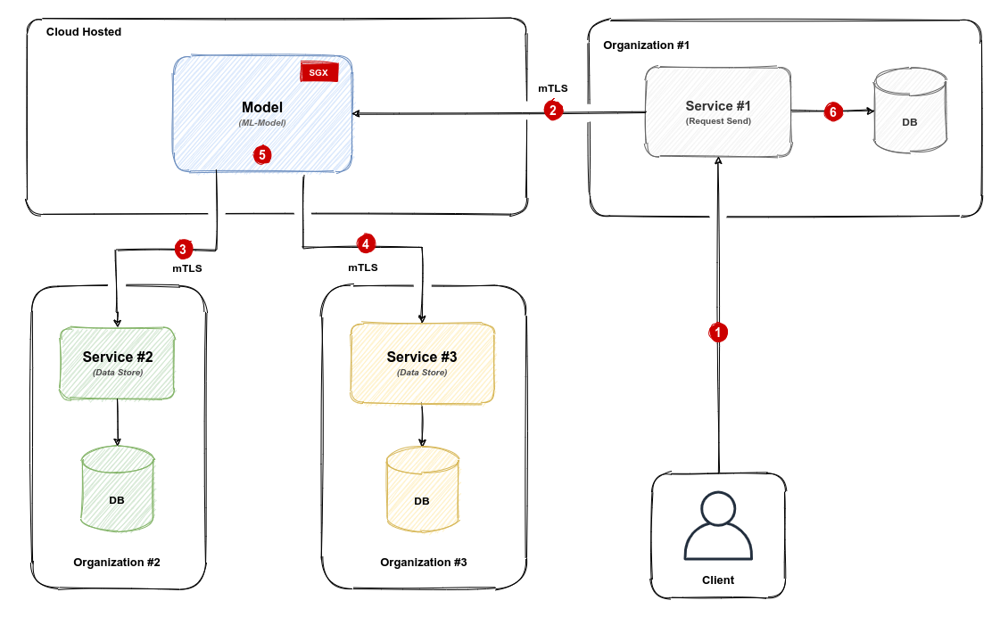

### Цель
Безопасная интеграция данными между разными организациями.
Главное условие - организации готовы поставлять данные для расчета в зашифровонном виде без доступа к чтению другим организациям. 

### Запуск связки Сервисов 

```bash
docker-compose up
```

### Отправка http-запроса от клиента

```python
curl http://127.0.0.1:8080/predict/{:id}
```

### Результат расчета
```bash
{"score":...}
```

### Описание процесса

1) Клиент #1 запрашивает информацию у организации #1
```bash
curl http://127.0.0.1:8080/predict/1
```
2) Организация #1 отправлят по защищенному каналу связи информацию о клиенте для расчета показателя в Сервис Model
3) Сервис Model по защищенному каналу связи опрашивает организацию #2 для обогащения информацией о клиенте #1
4) Сервис Model по защищенному каналу связи опрашивает организацию #3 для обогащения информацией о клиенте #1
5) Сервис Model создает входной вектор для ML-модели и проивзодит расчет
6) Организация #1 получает ответ от Сервиса Model, сохраняет ифномацию в БД и передает ее клиенту

P.S. В примере `docker-compose` нету примера работы c БД и mTLS.

### Вопросы
1) Возможно ли такая схема обмена данными
2) Какие необходимы действия для установления защищенного соединеня с сервером ``SGX``
3) При попытке сохранить данные на стороне Сервис Model - что мы увидим
4) При попытке войти в terminal Сервис Model - что мы увидим 
5) При попытке запуска запуска Сервис Model без SGX что будет
6) Логи stdout Севрис Model - в каком виде